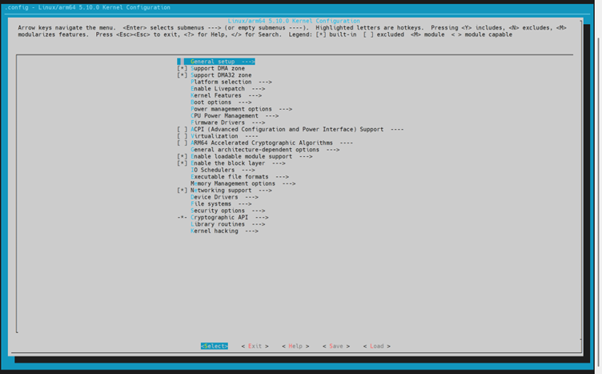
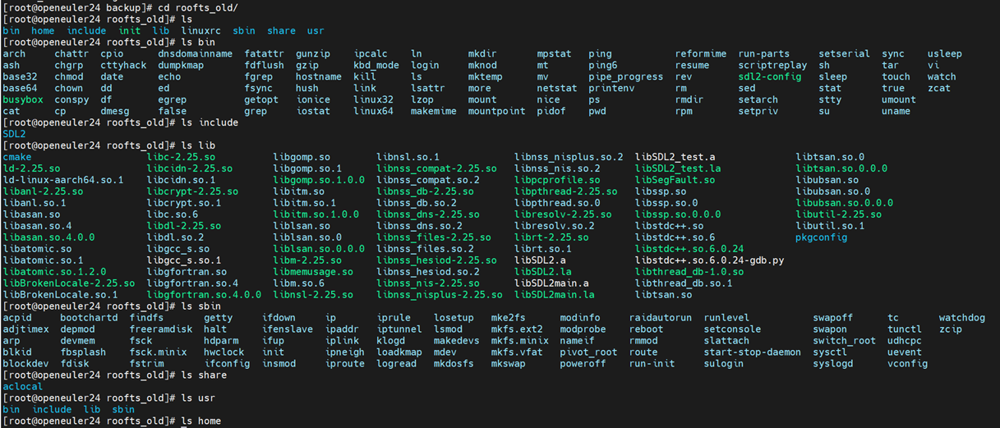
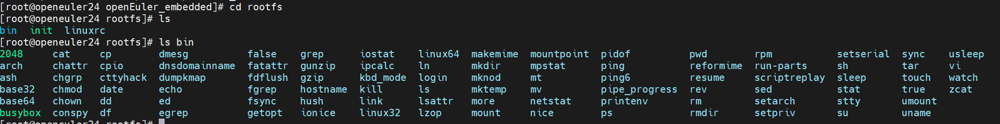
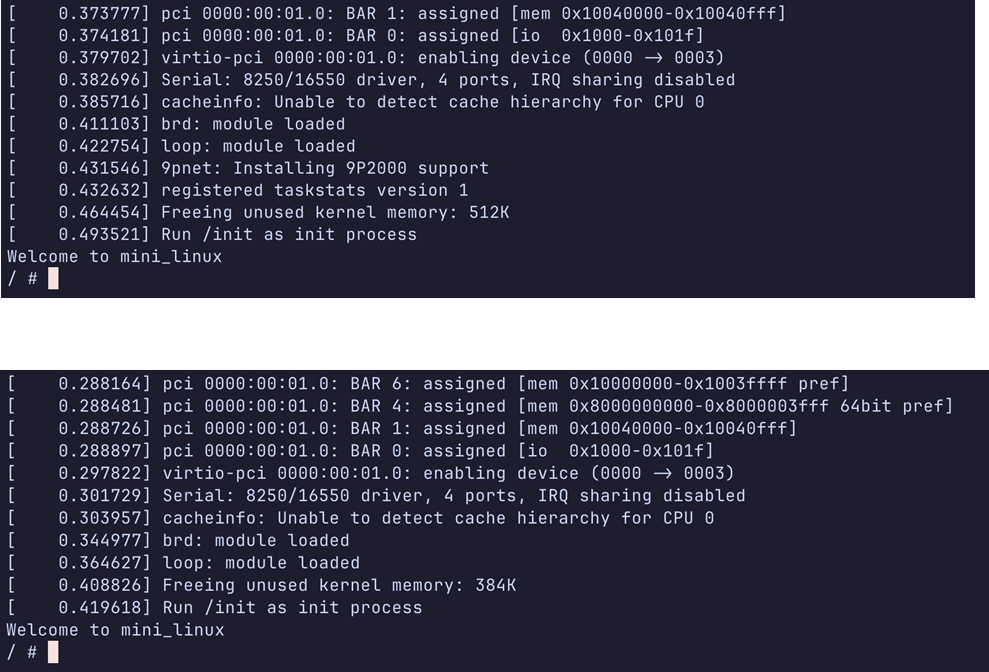
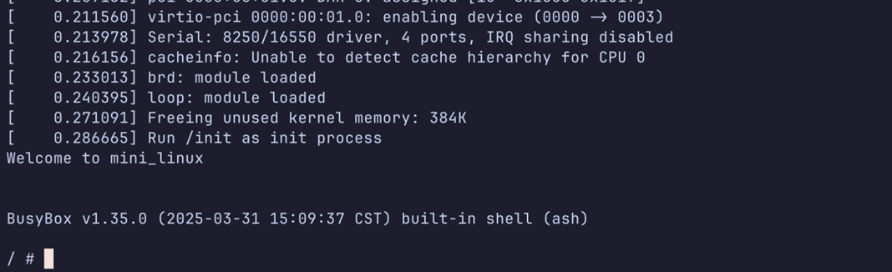

# 第一次大作业总结报告-第四组

**第四小组**

| 成员 | 任科吉        | 汪琦          | 熊昱晶        |
| ---- | ------------- | ------------- | ------------- |
| 学号 | 2023270903008 | 2023010905015 | 2023310101020 |

**指导教师：郝家胜**

## 一、实验项目名称

基于 QEMU 的 Linux 内核与根文件系统裁剪及个性化应用定制 

## 二、任务完成摘要

本次大作业旨在定制一个精简的 Linux 系统，使其能够在 QEMU 仿真环境中快速启动并执行特定的个性化任务。我们围绕以下几个核心方面完成了任务：

1.  **Linux 内核裁剪** ：通过 `make menuconfig` 对 Linux 内核进行了详细配置和裁剪，移除了大量非必需的驱动和功能模块，显著减小了内核镜像体积。
2.  **根文件系统构建与精简** ：基于 BusyBox 构建了根文件系统，同样使用 `menuconfig` 精心挑选了必要的命令行工具，并启用了静态编译，进一步压缩了系统大小。
3.  **个性化应用实现** ：设计并实现了一个基于 C 语言的终端版 2048 小游戏，通过静态编译生成可执行文件，并将其集成到根文件系统中，实现了开机自启动游戏的功能。
4.  **系统集成与测试** ：将裁剪后的内核与精简的根文件系统集成，利用 QEMU 进行了启动测试，验证了系统的可运行性，并对比了裁剪前后的启动时间，效果显著。
5.  **技术探索与对比** ：尝试了 Toybox 作为 BusyBox 的替代方案，并分析了其特点与适用性；实践了 Linux 内核补丁的应用方法。

## 三、实验原理

1.  **Linux 内核配置 (`Kconfig`/`menuconfig`)** ：Linux 内核使用 Kconfig 系统进行配置。`make menuconfig` 提供了一个基于文本菜单的界面，允许开发者选择需要编译进内核的功能、驱动和子系统。配置结果保存在 `.config` 文件中，`make` 命令依据此文件进行编译。
2.  **BusyBox** ：是一个集成了许多常见 Linux 命令和工具的单一可执行文件。它被设计用于资源受限的环境（如嵌入式系统），通过 `make menuconfig` 可以选择需要包含的命令，并支持静态编译，减少对外部库的依赖。
3.  **根文件系统 (Root Filesystem)** ：是 Linux 系统启动后挂载的第一个文件系统，包含了维持系统运行所必需的核心目录（如 `/bin`, `/sbin`, `/etc`, `/lib`, `/dev` 等）和基本的用户空间程序。`initramfs` (Initial RAM Filesystem) 是一种临时的、基于内存的根文件系统，在内核启动早期加载，用于挂载真正的根文件系统。
4.  **静态编译 (Static Compilation)** ：在编译程序时，将所有需要的库函数代码直接复制到最终生成的可执行文件中。这样做的好处是程序不依赖外部的共享库文件即可运行，移植性好，但在体积上会比动态链接的程序大。
5.  **QEMU (Quick Emulator)** ：是一个开源的通用机器模拟器和虚拟器。它可以模拟多种 CPU 架构（如 ARM, x86 等），允许在一个平台上运行为另一个平台编译的操作系统和程序，常用于嵌入式开发和系统测试。
6.  **Linux 内核补丁 (`patch`)**：`patch` 命令用于将 `diff` 命令生成的差异文件（补丁文件）应用到原始文件上，从而实现对源代码的修改。这是 Linux 内核开发中常用的代码更新和修复方式。

## 四、实验目标

1.  **系统精简**：显著裁剪 Linux 内核和根文件系统，减小系统镜像体积。
2.  **快速启动**：优化后的系统在 QEMU 仿真环境中实现更快的启动速度。
3.  **功能定制**：集成一个具有特定功能的个性化应用（终端小游戏），并具备展示性。

## 五、实验内容

1.  **Linux 内核配置与裁剪**：选择合适的内核配置选项，移除不必要的模块。
2.  **BusyBox 根文件系统构建与裁剪**：配置 BusyBox，生成包含必要工具的静态编译根文件系统。
3.  **个性化应用开发与集成**：编写或移植一个简单的终端应用（2048 游戏），并将其集成到根文件系统中。
4.  **系统启动与测试**：使用 QEMU 启动定制后的 Linux 系统，测试其功能和性能。
5.  **技术探索**：尝试 Toybox 根文件系统和应用内核补丁。

## 六、实验器材

1.  **Linux 开发主机**：用于编译内核、BusyBox 和应用程序的环境 (如 Ubuntu, openEuler 等)。
2.  **交叉编译工具链**：`aarch64-linux-gnu-` 用于编译 ARM64 架构的代码。
3.  **QEMU 模拟器**：`qemu-system-aarch64` 用于模拟 ARM64 硬件平台。
4.  **Linux 内核源代码**：需要进行裁剪的内核源码树。
5.  **BusyBox 源代码**：用于构建根文件系统的工具集源码。
6.  **文本编辑器**：用于编辑代码和配置文件。
7.  **Bash/Shell 终端**：执行所有命令操作。

## 七、实验步骤

### 1. 内核配置与裁剪

*   **方法**：
    *   基于 `openeuler_embedded_defconfig` 生成初始 `.config` 文件。
    *   使用 `make menuconfig` (基于 ncurses 的文本菜单界面) 进行详细配置，因其响应快且支持搜索，优于 `make config` (逐项询问) 和 `make gconfig` (图形界面，可能卡顿)。
    *   利用搜索功能 (`/`) 定位配置项，参考帮助信息 (`h`)，注意依赖关系。
    
*   **代码示例**：
    ```bash
    # 生成初始配置文件
    make ARCH=arm64 openeuler_embedded_defconfig
    
    # 进入 menuconfig 界面进行裁剪
    make ARCH=arm64 CROSS_COMPILE=aarch64-linux-gnu- menuconfig
    
    # 编译内核镜像 (-j8 使用 8 个并行任务加速)
    make ARCH=arm64 CROSS_COMPILE=aarch64-linux-gnu- -j8
    ```
    
*   **裁剪记录**：
    
    1. Device Drive：
    
       - Network Device Support
    
       - SPI Support
    
       - Userspace I/O drivers (UIO)
    
       - USB support
    
       - Watchdog Timer Support
    
       - GPIO Support (General Purpose Input/Output)
    
       - Multiple devices driver support (RAID and LVM)
    
       - Memory Technology Device (MTD) support
    2. Support DMA zone
    3. Support DMA32 zone（RAM>4GB时不可裁剪）
    4. Network
       - TCP/IP: 除本体外所有
       - Packet socket
       - PF_KEY sockets
       - Network packet filtering framework (Netfilter)
       - The TIPC Protocol
       - 802.1Q/802.1ad VLAN Support
       - DNS Resolver support
    5. General Setup除以下其余全部裁剪：
       - System V IPC
       - Initial RAM filesystem and RAM disk (initramfs/initrd) support（仅保留gzip，其余裁剪掉，根据initrd文件格式来定）
       - Embedded system
       - SLUB per cpu partial cache
    6. Keneral Hacking：除启动计时器外全关
    7. Security options:
       - Enable different security models
       - Enable the securityfs filesystem
    8. File Systems
       - The Extended 3 (ext3) filesystem
       - Direct Access (DAX) support
       - Dnotify support
       - Filesystem wide access notification
       - Quota support
       - Kernel automounter support
       - FUSE (Filesystem in Userspace) support
       - Overlay filesystem support
       - General filesystem local caching manager
       - ISO 9660 CDROM file system support
       - UDF file system support
       - MSDOS fs support
       - VFAT (Windows-95) fs support
       - HugeTLB file system support
       - Network File Systems
       - Miscellaneous filesystems:
         - Compressed ROM file system support (cramfs)
         - SquashFS 4.0 - Squashed file system support
    9. Memory Management options
       - Allow for memory hot-add
       - Allow for memory compaction
       - Page migration
       - Allow for memory compaction
       - Enable KSM for page merging
       - Enable recovery from hardware memory errors
       - Memory allocator for compressed pages
    10. IO Schedulers:
        - MQ deadline I/O scheduler
    11. Executable file formats:
        - Write ELF core dumps with partial segments
        - Enable core dump support
    12. CPU Power Management全部
    13. Power management options全部
    
    
    
*   **分析**：
    
    *   主要裁剪了大量非必需的设备驱动 (网络、USB、SPI、GPIO、RAID、MTD 等)、网络协议 (除 TCP/IP 核心外)、文件系统 (保留 ext3/4, tmpfs 等基础类型)、内核调试选项、部分内存管理和电源管理特性。
    *   保留了嵌入式系统支持、必要的 DMA 支持、Initramfs 支持 (仅 Gzip 格式)、基本 Shell 和核心系统功能。
    *   裁剪依据是目标平台 (QEMU 模拟环境) 和个性化应用 (简单终端游戏) 的实际需求，力求最小化。
    *   *附图：menuconfig 界面*
        

### 2. 基于 BusyBox 的根文件系统构建与裁剪

*   **方法**：
    *   类似内核配置，使用 `make defconfig` 生成默认配置，然后 `make menuconfig` 进行裁剪。
    *   关键在于 **启用静态编译** (`CONFIG_STATIC=y`)，避免运行时依赖外部共享库。
    *   仅勾选项目运行所需的最少命令 (如 `sh`, `ls`, `cat`, `echo`, `mount`, `init` 以及游戏运行可能依赖的简单命令)。
    *   使用 `strip` 工具进一步去除可执行文件中的符号信息，减小体积 (通常在 `make install` 过程中自动完成或手动执行)。
*   **代码示例**：
    ```bash
    # 进入 BusyBox 源码目录
    cd busybox-1.35.0
    
    # 创建默认配置
    make ARCH=arm64 CROSS_COMPILE=aarch64-linux-gnu- defconfig
    
    # 进入 menuconfig 界面进行裁剪和配置静态编译
    make ARCH=arm64 CROSS_COMPILE=aarch64-linux-gnu- menuconfig
    
    # 编译并安装到指定目录 (./_install)
    make ARCH=arm64 CROSS_COMPILE=aarch64-linux-gnu- -j8
    make ARCH=arm64 CROSS_COMPILE=aarch64-linux-gnu- install
    
    # 拷贝 _install 下的内容
    mkdir -p ~/qemu/openEuler_embedded/rootfs/{home,lib}
    cd ~/qemu/openEuler_embedded
    cp -af ~/source_code/busybox-1.35.0/_install/* rootfs/
    cp -af ~/source_code/gcc-linaro-7.5.0-2019.12-x86_64_aarch64-linux-gnu/aarch64-linux-gnu/libc/lib/*.so* rootfs/lib/
    
    # 新建 rootfs/init 文件并添加可执行权限：
    #!/bin/sh
    echo Welcome to mini_linux
    exec /bin/sh +m
    
    cd rootfs && find . -print0 | cpio --null -ov --format=newc | gzip -9 > ../rootfs.gz && cd ..
    
    ```
*   **分析**：
    *   目标是创建一个仅包含运行 2048 游戏和基本系统维护所需命令的最小根文件系统。
    *   保留了核心 shell (`sh`)、文件操作命令 (`ls`, `cat`, `cp`, `mv`, `rm`, `pwd`)、系统管理命令 (`mount`, `umount`, `reboot`, `poweroff`, `ps`, `kill`) 以及游戏启动脚本 (`game.sh`) 和游戏可执行文件 (`2048`)。
    *   静态编译是关键，确保了 BusyBox 工具集和我们的游戏能在没有 `/lib` 目录下共享库的环境中运行。
    *   *附图：裁剪前后的 rootfs 内容对比*
        *   *裁剪前*: 
        *   *裁剪后*: 

### 3. 个性化应用 (2048 游戏) 开发与集成

*   **方法**：
    *   选择 C 语言实现的终端版 2048 游戏，因其依赖少，易于静态编译。
    *   使用交叉编译工具链进行 **静态编译**。
    *   将生成的可执行文件 (`2048`) 复制到根文件系统的 `/bin` 目录下。
    *   修改 `/init` 脚本，使其在系统启动后自动执行游戏程序。
*   **代码示例**：
    ```bash
    # 编译 C 语言源文件 main.c 为静态可执行文件 2048
    aarch64-linux-gnu-gcc -static -o 2048 main.c
    
    # 检查生成的文件格式
    file 2048
    #Output
    2048: ELF 64-bit LSB executable, ARM aarch64, version 1 (SYSV), statically linked, BuildID[sha1]=..., for GNU/Linux 3.7.0, not stripped
    
    # 将可执行文件复制到构建的根文件系统目录
    cp 2048 ./rootfs/bin/
    ```
*   **分析**：
    *   最初尝试过图形化游戏和纯 Bash 脚本游戏。图形化游戏因依赖库 (ncurses, SDL) 静态编译困难而放弃；Bash 游戏因目标系统可能只提供 `sh`/`ash` (语法不完全兼容 Bash) 而遇到障碍。
    *   最终选择 C 语言 + 静态编译的方案，具有最佳的可移植性和最少的运行时依赖。
    *   游戏逻辑简单，仅使用标准 C 库函数和基本的终端控制字符，适合精简环境。
    *   通过修改 `init` 脚本实现 `exec /bin/2048`，使得系统启动后直接进入游戏界面，满足个性化展示需求。

### 4. 系统集成与 QEMU 测试

*   **方法**：
    *   使用 `qemu-system-aarch64` 命令加载裁剪后的内核 (`Image`) 和打包好的根文件系统 (`rootfs.gz`)。
    *   观察启动日志，记录启动时间。
    *   测试游戏是否能正常运行。
*   **代码示例**：
    ```bash
    qemu-system-aarch64 \
        -M virt-4.0 \
        -cpu cortex-a57 \
        -m 1G \
        -kernel Image.gz \
        -initrd rootfs.gz \
        -nographic
    ```
*   **分析**：
    *   通过 QEMU 成功启动了定制的 Linux 系统。
    *   验证了 2048 游戏能够正常运行。
    *   记录并对比了启动时间，证明了内核和根文件系统裁剪的有效性。

### 5. 技术探索：Toybox 与内核补丁

*   **Toybox 尝试**：
    *   探索了 Toybox 作为 BusyBox 的替代品。Toybox 设计更现代，代码更清晰，但默认配置下对静态编译的支持不如 BusyBox 成熟，且社区和文档相对较小。对于本项目需要强制静态链接的场景，BusyBox 更为合适。
*   **内核补丁应用**：
    *   实践了使用 `patch` 命令给内核源码打补丁。创建了一个简单的 `fair.patch` 文件 (修改 `kernel/sched/fair.c`)，并使用 `patch < fair.patch` 命令成功应用。理解了补丁在代码分发和版本管理中的作用。
    *   *补丁脚本示例*：
        
        ```sh
        #!/bin/sh
        patch ./kernel-22.09/kernel/sched/fair.c < ./fair.patch
        ```
    *   *补丁内容 (diff 格式)*：
        ```diff
        --- origin_fair.c	2025-03-24 17:02:41.295429785 +0800
        +++ fair.c	2025-03-24 16:12:43.179751251 +0800
        @@ -4544,6 +4544,7 @@
         		return;
         	}
         end:
        +	;
         #ifdef CONFIG_DTS
         	if (curr_task) {
         		curr_task->by_pass = END_BY_PASS;
        ```

## 八、实验数据及结果分析

| **阶段**                           | **QEMU 启动时间 (大约)** | **分析**                                                     |
| :--------------------------------- | :----------------------- | :----------------------------------------------------------- |
| 原始内核 + 默认 BusyBox rootfs     | ~0.49 秒                 | 基线性能，包含大量未使用的功能和驱动。                       |
| 裁剪后内核 + 默认 BusyBox rootfs   | ~0.41 秒                 | 内核裁剪有效，减少了初始化时间和内存占用，启动速度有所提升。 |
| 裁剪后内核 + 裁剪后 BusyBox rootfs | **~0.28 秒**             | 根文件系统精简和静态编译进一步显著减少了加载和初始化时间，效果最佳。 |

*   **启动时间对比图示**：
    
    分别为裁剪前、裁剪内核后和裁剪内核和根文件系统后：
    
     
    
*   **结果分析**：
    *   实验数据清晰地表明，通过对 Linux 内核和 BusyBox 根文件系统的精细裁剪，并结合静态编译策略，成功将 QEMU 环境下的系统启动时间从约 0.49 秒压缩至约 0.28 秒，性能提升显著。
    *   最终系统体积小巧，功能专一（启动后直接运行 2048 游戏），满足了项目要求。
    *   个性化应用 (2048 游戏) 在精简后的系统中运行稳定。

## 九、实验结论

本次实验成功地完成了一个定制化 Linux 系统的设计与实现。通过：

1.  **有效的内核裁剪**：利用 `menuconfig` 移除了大量冗余组件。
2.  **精简的根文件系统构建**：基于 BusyBox 并采用静态编译，只包含必需工具。
3.  **成功的应用集成**：将静态编译的 C 语言 2048 游戏集成并设为开机自启动。

我们最终获得了一个体积小、启动快（QEMU 启动时间缩短约 43%）、功能明确（启动即游戏）的嵌入式 Linux 系统原型。实验结果达到了预期的目标。

## 十、总结及心得体会

### 总结

本项目围绕 Linux 系统定制的核心任务，实践了内核裁剪、BusyBox 根文件系统构建、静态编译、个性化应用集成等关键技术环节。我们从选择配置工具 (`menuconfig`) 到具体裁剪策略，再到应用选型与编译方式，都进行了细致的考量和尝试。最终，通过 QEMU 验证了定制系统的性能提升和功能实现，达到了项目目标。整个过程加深了对 Linux 系统启动流程、内核结构、用户空间构建以及嵌入式系统优化策略的理解。

### 心得体会

1.  **`menuconfig` 是强大的武器** ：熟练使用 `menuconfig` 的搜索、帮助和依赖关系查看功能，是高效进行内核和 BusyBox 裁剪的关键。理解每个选项的含义至关重要，"if unsure, say no" 是一个保守但有效的策略。
2.  **静态编译的价值** ：在嵌入式或需要高移植性的场景下，静态编译能有效解决库依赖问题，简化部署。虽然会增加单个可执行文件的体积，但对于整体系统大小和稳定性往往利大于弊。本次项目中，静态编译是确保游戏能在极简 rootfs 中运行的核心。
3.  **应用选型的权衡** ：在资源受限的环境下开发应用，需要仔细权衡功能复杂度与环境依赖。图形化界面、特定脚本解释器（如 Bash vs sh/ash）都可能引入额外的复杂性。选择依赖少、易于编译（尤其是静态编译）的应用是明智之举。
4.  **理论与实践的结合** ：理解 Linux 启动流程、内核模块、文件系统结构等理论知识，对于指导裁剪实践非常有帮助。例如，知道 `initramfs` 的作用，才能正确地构建和使用它。
5.  **耐心与细致不可或缺** ：系统裁剪和构建过程中，配置错误、编译失败、启动异常是常有的事。需要耐心排查日志、分析错误信息，细致地调整配置和代码。例如，从尝试图形游戏到 Bash 脚本再到 C 语言静态编译，就是一个不断试错和调整的过程。
6.  **工具链和环境的重要性** ：确保交叉编译工具链配置正确，理解 `ARCH` 和 `CROSS_COMPILE` 环境变量的作用，是跨平台开发的基础。

通过这次大作业，我们不仅掌握了 Linux 系统定制的基本流程和技巧，更锻炼了分析问题、解决问题以及在限制条件下进行工程实践的能力。

---